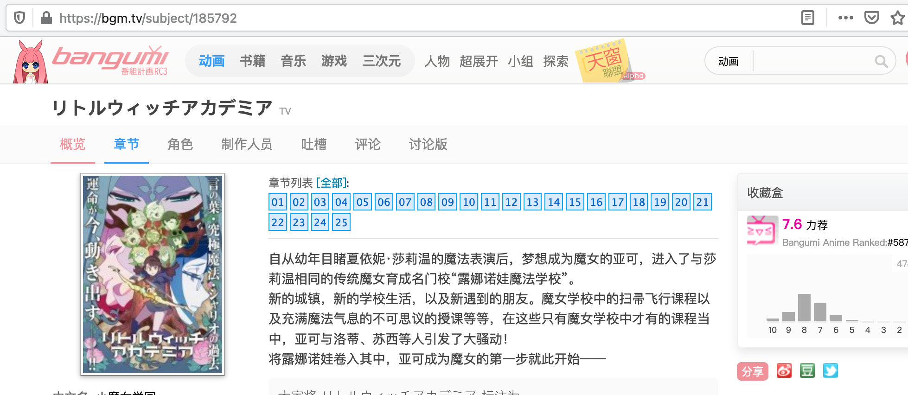

# dantalian

[简体中文](./README_cn.md)

Dantalian is a nfo file generator for your anime, source from [bangumi](https://bangumi.tv/). You can use these nfo
files with media center software such as [Jellyfin](https://jellyfin.org/), [Kodi](https://kodi.tv/).

Some Popular scrapers, such as ["The Movie DB"](https://www.themoviedb.org), ["The TV DB"](https://thetvdb.com/)
put all episodes not published in TV into Season 00, including all SPs and OVAs. It is not suitable for anime,
which usually has multiple OVAs or SPs series, especially the
["Monogatari (series)"](https://www.themoviedb.org/tv/46195/season/0).  [AniDB](https://anidb.net/) put episodes in the
right place, but It only has English Infos.

So, Dantalian uses bangumi as anime source to generate nfo files. In media center software like Jellyfin or Kodi, nfo
files have higher priority than scrapers. As bangumi is not design for anime media file database, some data has lacked.
In general, this thing has the following peculiarity:

* One subject only has one season's episodes and SPs.
* It prefers anime characters' info to actors' info.
* Support custom tags in folder
* Lack of genres, tags. Lack of actors and staff info for a single episode
(Dantalian will use the whole series info as an alternative).
* Lack of a poster of a single episode. The media center software will capture it.

## File structure

### Source folder

Dantalina follow the conventions of Kodi to organize the structure of media files, nfo files, and the schema of nfo
files. For now, There are two types of folders: source folder, anime folder. For detail, you can see
[Source folder](https://kodi.wiki/view/Source_folder).

Briefly,  put anime folders in the source folder, and place media files in anime folders. As the example below:

```
<Source folder>/
├── ひぐらしのなく頃に 業
├── 化物語 [2009][BDRip]
├── [dantalian][202104][奇巧计程车ODD TAXI][01-13合集][BDRip][1080p]
├── 小魔女学园 [2017][TV]
└── 进击的巨人 最终季
```

* There are only two layers for folders: source folders > anime folder.
* The count of anime folders in one source folder is no limit.
* Don't mix in anime movies and tv animes or others folder in one source.


### TV anime folder

TV anime folder follows the conventions of "TV shows" of Kodi. For detail, you can see these links:

* [TV shows](https://kodi.wiki/view/Naming_video_files/TV_shows)
* [NFO files/TV shows](https://kodi.wiki/view/NFO_files/TV_shows)
* [NFO files/Episodes](https://kodi.wiki/view/NFO_files/Episodes)

```
<Source folder>/
└── 化物語 [2009][BDRip]
    ├── dantalian.toml
    ├── tvshow.nfo
    ├── 化物語 01.chs.ass
    ├── 化物語 01.mp4
    ├── 化物語 01.nfo
    ├── 化物語 02.chs.ass
    ├── 化物語 02.mp4
    ├── 化物語 02.nfo
    ├── 化物語 SP5.5.chs.ass
    ├── 化物語 SP5.5.mp4
    └── 化物語 SP5.5.nfo
```

In each tv anime folder, dantalian will generate one `tvshow.nfo` file and generate episode nfo files for each episode,
with the same name to the episode media file and "nfo" extension. And there is a config file named `dantalian.toml`.

### Anime movie folder

This type is not supported yet.

## Folder settings

There are three methods to setting anime folders.

### 1. Auto match bangumi subject

For now, the power of auto-match is limited. If searching in bangumi by name, you can get your anime in the first
result, and you can use this method. You can use this command to ensure:

```sh
dantalian bgm search <anime name>
```

The name can be the Chinese name or the Japanese name of anime. If it works, you can rename your anime folder to this: 

```
anime name [tag1][tag2]
```

And rename your episode files in this pattern:

```
anime name same as anime folder 12.mp4
```

For the spatial (SP) episode, you should add "SP" before the episode number.

### 2. Specify bangumi subject id manually

If auto-match doesn't work, you must specify the bangumi subject id manually. You should create a "dantalian toml" file
in the anime folder and input the bangumi subject id.

For example, the TV anime "小魔女学园" aired in 2017, you can search in bangumi website like this:



Notice the number "185792" after "/subject/" in URL, that is the subject id.
You can also use the command `dantalian bgm search 小魔女学园` to ensure the subject id:

And the rename episode files as method 1.

```
  * リトルウィッチアカデミア / 小魔女学园
    Subject ID: 185792
    Air Date: 2017-01-08
    URL: http://bgm.tv/subject/185792
```

Next, in the folder 小魔女学园, created config file "dantalian.toml" and input:

```toml
subject_id = 185792
```

And the rename episode files as method 1:

```
小魔女学园 12.mp4
```

### 3. Specify episode file pattern manually

Suppose you don't want to rename the anime folder and episode files. In that case, you can tell dantalian how to get the
subject id and episode number from episode files by regular expression in the dantalian config file.  For example, in
the folder `./examples/source/[dantalian][202104][奇巧计程车ODD TAXI][01-13合集][BDRip][1080p]`, episodes are named:

```sh
[dantalian][202104][奇巧计程车ODD TAXI][01][BDRip][1080p].mp4
[dantalian][202104][奇巧计程车ODD TAXI][02][BDRip][1080p].mp4
```

You can use these configs to define the name pattern: (subject_id is requiered)

```toml
subject_id = 325285
episode_re = "^.*\\[(?P<ep>\\d\\d)\\].*\\.mp4$"
```
The regular expression must have named capture groups, group "ep" capture the episode number, group "sp" captures
whether it is a special episode. By the way, in methods 1 & 2, dantalian will also complete the config file for
reference. For example, after dantalian run in "小魔女学园", dantalian will change the config file to:

```toml
subject_id = 185792
episode_re = "^(?P<name>リトルウィッチアカデミア|小魔女学园) (?P<sp>SP)?(?P<ep>[.\\d]+)\\."
```

## Generate nfo files

After setting all source files, you can generate nfo files by this command:

```
dantalian --source <source folders>
```

You can specify multiple source folders at once.

As the file is used and played, the media center software will modify nfo files to store dynamic data. Because of this
situation, dantalian will not re-generate nfo files if it already exists. If you want to force re-generate, you can add
the `--force <anime folder name>` option to the command. You can specify multiple folders.

## Roadmap

- [ ] Anime Movie / "theater edition"
- [ ] BD file
- [ ] DVD file
- [x] Custom file pattern or fuzzy match.
